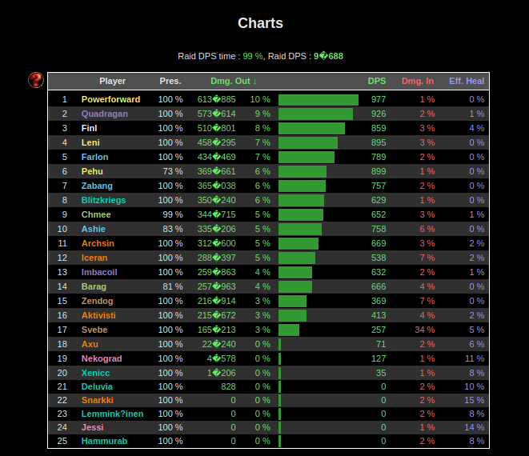

# WWSParseExtractor

## Installing

This script will run as root so please [inspect it](install) before running. 

```sh
curl https://raw.githubusercontent.com/Kruhlmann/WWSParseExtractor/master/install | sudo sh
```

## Running

Example exection:

```sh
<binary> http://sisuguild.fi/~juha/wws/20070610-magtheridon/ /tmp/
```

Produces the following stdout:

```
Wrote file /tmp/rog_20070610-magtheridon_Powerforward.csv
Wrote file /tmp/wrl_20070610-magtheridon_Quadragan.csv
Wrote file /tmp/pri_20070610-magtheridon_Finl.csv
Wrote file /tmp/rog_20070610-magtheridon_Leni.csv
Wrote file /tmp/mag_20070610-magtheridon_Farlon.csv
Wrote file /tmp/rog_20070610-magtheridon_Pehu.csv
Wrote file /tmp/mag_20070610-magtheridon_Zabang.csv
Wrote file /tmp/sha_20070610-magtheridon_Blitzkriegs.csv
Wrote file /tmp/hnt_20070610-magtheridon_Chmee.csv
Wrote file /tmp/mag_20070610-magtheridon_Ashie.csv
Wrote file /tmp/drd_20070610-magtheridon_Archsin.csv
Wrote file /tmp/drd_20070610-magtheridon_Iceran.csv
Wrote file /tmp/wrl_20070610-magtheridon_Imbacoil.csv
Wrote file /tmp/hnt_20070610-magtheridon_Barag.csv
Wrote file /tmp/war_20070610-magtheridon_Zendog.csv
Wrote file /tmp/drd_20070610-magtheridon_Aktivisti.csv
Wrote file /tmp/war_20070610-magtheridon_Svebe.csv
Wrote file /tmp/drd_20070610-magtheridon_Axu.csv
Wrote file /tmp/pal_20070610-magtheridon_Nekograd.csv
Wrote file /tmp/sha_20070610-magtheridon_Xenicc.csv
Wrote file /tmp/sha_20070610-magtheridon_Deluvia.csv

Process finished with exit code 0
```

From the retrieved HTML table:


